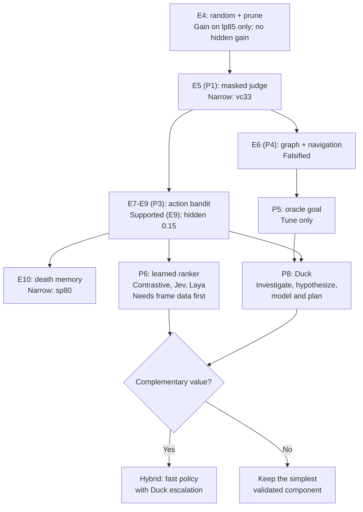

# ARC-AGI-3 Research — Session Handoff

**Prepared:** 18 September 2026  
**Updated:** 4 October 2026 (Build 6's hidden-set score; C2's labels derived)  
**Current phase:** `T-C2a` — labels derived, criterion 4 recorded as mis-specified; awaiting the `tests` gate and an independent review  
**Completed:** E0–E11, Builds 1–6, C1 (frame collection); hidden set: Build 4 (bandit) **0.15**, Build 6 (plus death memory) **0.15**, Build 5 (uniform arms) **0.12**  
**Planned:** label derivation from the C1 frames, then E12 (design P5, oracle goal — drafted but **deferred**), P6 learned ranker (contrastive / Jev / Laya), P7 image vs text, P8 Duck Harness, and a fast/slow hybrid only if P6 and P8 justify it  
**Purpose:** Give a new ChatGPT/Claude session enough context to continue the research without reconstructing the earlier discussion.

> **Numbering note.** Earlier copies of this handoff used "E5 = Duck", "E6 = contrastive ranker / Jev / Laya" and "E7 = hybrid". Those labels were never register numbers. The register assigns the next free E-number when an experiment is pre-registered: E5–E7 went to P1, P4 and P3 from `documents/research_design/next_phase_experiment_design.md`, and E8–E10 to the bandit's follow-up tests. This file refers to planned work by its design ID (P2–P8). Duck and the contrastive ranker get E-numbers when they are pre-registered.

---

## 1. Project Goal

The project asks:

> What minimum intelligence does each part of ARC-AGI-3 gameplay require?

ARC-AGI-3 presents unfamiliar interactive games without instructions. An agent must act, observe consequences, learn mechanics, infer goals, and eventually solve levels.

The research is deliberately not optimized to prove that a particular model works. It should discover:

- what simple algorithms can already do;
- where simple exploration stops being sufficient;
- whether explicit reasoning and world modelling add value;
- whether fast learned decision-making adds value;
- whether a later fast/slow hybrid is justified.

No new experiment should be run merely because it is technically interesting. Each experiment should isolate one important capability and have a falsifier written before execution.

---

## 2. Current Experiment Roadmap

| Experiment | Status | Main question |
|---|---|---|
| E0 | Complete | Can frozen Gemma models beat random action selection? |
| E1 | Complete | Does simple harness memory improve exploration or solving? |
| E2 | Complete; abandoned at tune | Does explicitly describing control effects reduce wasted actions? |
| E3 | Complete; stopped at tune | Can the agent distinguish actions taken to learn from actions taken to make progress? |
| E4 | Complete | How far can random action selection plus dead-action pruning go? |
| E5 (P1) | Complete; **narrow**, carried by `vc33` | Does ignoring progress-bar cells when judging "did anything change?" let pruning clear more levels? |
| E6 (P4) | Complete; **falsified** | Does remembering transitions and navigating back to states with untried actions clear more levels? |
| E7 (P3) | Complete; **narrow** at 300 (primary); broad at 1,000 (not decisive) | Does learning within an episode which action classes produce new states beat uniform choice over the same classes? |
| E8 | Complete; **narrow** (`lf52`) | E7's bandit re-run with 1,000 actions primary, fresh episodes 120–139 |
| E9 | Complete; **supported** | The same on 40 fresh episodes (140–179) |
| E10 | Complete; **narrow** (`sp80`), as predicted | Does a per-screen memory of deadly moves fix the bandit's death loops? |
| E11 (P2) | Complete; **falsified** (totals and RHAE favour it; the per-seed test does not) | Inside the bandit, do clicks aimed at objects beat clicks at a random cell of the chosen colour? |
| Build 4 | Submitted: hidden set **0.15** (Builds 1 and 3: 0.07) | E9's bandit in the Kaggle agent, 1,000 actions |
| Build 5 | Submitted: hidden set **0.12** | Uniform arms at 1,000 actions: splits Build 4's gain (+0.05 setup, +0.03 bandit) |
| Build 6 | Submitted 3 Oct: hidden set **0.15** — **no change from Build 4** | E10's death memory in the Kaggle agent: B′'s only unseen test, and it did not transfer |
| C1 | **Complete and reviewed** | Collect frames so a ranker can be trained and a goal predicate annotated (a collection, not an experiment: no hypothesis, no verdict) |
| C2 | **Derived** (320,000 rows); criterion 4 recorded as **mis-specified**, integrity resting on criteria 1, 2, 3, 5 and zero label-store disagreements | Fix the meaningful-change labels, in writing, before any model sees the data (again a collection, not an experiment) |
| E12 (P5) | Drafted, then **deferred** before any code | If the goal were known (oracle, tune games only), how many more levels would the bandit clear? |
| P6 | Unblocked: C1's frames exist; the label derivation comes next | Can a learned cross-game action ranker (contrastive; optional Jev/Laya arms) beat the bandit? |
| P7 | Parked until GPU time | Does the same frozen Gemma play better from an image than from text? |
| P8 | Parked | Does a Duck-style investigation harness beat the best CPU policy, and does it discover mechanics? |
| Hybrid | Only if P6 and P8 both succeed with complementary per-game wins | Fast policy with Duck escalation |

E3 was originally parked because a similar mechanism had already been published on the benchmark. It was explicitly unparked, run on 19 September 2026, and stopped at the tune stage under its preregistered rule.

---

## 3. Established Experimental Setup

- Benchmark: ARC Prize 2026, ARC-AGI-3 track.
- Public games: 25, split once into 8 tune games and 17 held-out games using a fixed seed.
- Verdict set: 16 held-out games; `r11l` is reported but excluded from verdict aggregates because random can beat its human baseline on level 1.
- Model runs (E0–E3): normally 80 actions per episode and 5 seeds.
- E4: 20 seeds (episodes 0–19) at 80- and 300-action budgets.
- E5–E7 (CPU, no model): 20 seeds, episodes **100–119**, paired across conditions and experiments; budgets 300 (primary) and 1,000.
- E8: episodes **120–139** (20 seeds), 1,000 primary. E9: **140–179** (40 seeds), 1,000 only. E10: **180–219** (40 seeds), 1,000 only. E11: **220–259** (40 seeds), 1,000 only. Every block used episodes no earlier experiment had used.
- Machine limit: 8 GB with about 1 GB free. Held-out conditions run **one process at a time**, the slow ones in resumable chunks of 10 episodes. The runner itself does not leak (flat at about 300 MB).
- Primary metric: levels cleared.
- Secondary/dense metrics:
  - RHAE;
  - distinct screens (masked states since E5) per 100 actions;
  - dead-move rate (measured by the common masked judge since E5);
  - repeat deaths (since E10);
  - action efficiency where relevant.
- Verdict test since E4: per-seed paired difference in verdict clears, one-sided exact sign test, ties dropped, plus a **concentration rule** (the result must survive removing the game with the largest gain, and at least 2 games must improve). A pass that fails the concentration rule is reported as "narrow: carried by `<game>`".
- Experiment discipline:
  - hypothesis and pass/fail rule recorded before running;
  - verdict scripts committed before any result exists (since E8);
  - tune games select settings or cause abandonment, but do not establish an effect;
  - held-out games determine the verdict;
  - dated amendments are added instead of silently changing earlier claims;
  - headline numbers are recomputed from saved results.

Canonical project record: `research_prep/notes/experiment_register.md`. Where this handoff and the register differ, the register wins.

---

## 4. Results So Far

### E0 — Frozen models did not beat random

Question: Can a frozen model choose useful actions directly from a text rendering of the screen?

| 16 verdict games, 80 actions, 5 seeds | Random | Gemma-4-E4B | Gemma-4-31B |
|---|---:|---:|---:|
| Levels per game | **0.0125** | 0.000 | 0.000 |
| RHAE | 0.0348 | 0.0000 | 0.0000 |
| Distinct screens per 100 actions | 78.5 | 68.6 | 73.2 |
| Same metric, click games only | 73.5 | 59.6 | 66.1 |

Main interpretation:

- Neither Gemma size cleared a verdict level.
- Random cleared one level across the 80 verdict episodes.
- The models' exploration deficit was concentrated in click-based games.
- They repeatedly clicked cells that did nothing.
- Increasing model size by roughly eight times reduced the exploration gap but did not produce level clears.
- Qwen3-8B was a scaffold failure and must not be interpreted as evidence that the model itself plays worse.

### E1 — Simple memory improved exploration but not solving

Two mechanisms were tested:

1. `prune-visited`: if an action leaves the screen unchanged, prevent the model from repeating it on that screen and substitute a random live action.
2. `failure-rules`: after a death, add a fixed-format note about what preceded it.

| 16 verdict games | Random | Control | Prune only | Rules only | Both |
|---|---:|---:|---:|---:|---:|
| Level clears | 1 | 0 | 1 | 0 | 1 |
| Distinct screens per 100 actions | 78.5 | 68.6 | 74.4 | 69.6 | 74.5 |

Interpretation:

- Pruning accounts for nearly all the improvement.
- Failure-rule memory did almost nothing at the tested budget.
- The combined treatment beat the frozen-model control but only tied random on clears.
- Simple memory made exploration more efficient without making the agent meaningfully smarter.
- The one clearing episode relied heavily on random substituted moves.

### E2 — Telling the model what controls do backfired

The harness first tested actions and described their cell-level effects to the model. A matched control received the same number of extra actions but no descriptions.

| Tune games, 3 seeds | k = 5 | k = 10 | k = 20 |
|---|---:|---:|---:|
| Dead-move rate with probe | 0.344 | 0.321 | 0.333 |
| Matched control | 0.284 | 0.303 | 0.293 |

Interpretation:

- The probe increased dead moves at every tested value of *k*.
- It changed behaviour and sometimes increased exploration, so it was not simply ignored.
- The experiment cannot distinguish a bad representation of control effects from a wrong underlying hypothesis.
- General lesson: possessing action-effect information is not the same as using it productively.

### E3 — Labelling moves “learn” or “win” did not help

Treatment:

- The model began each reply with `LEARN` for a move intended to discover how the game works, or `WIN` for a move intended to progress toward the goal.
- After a `LEARN` move, the harness recorded the observed screen change.
- The model received its five most recent recorded experiments.
- Unlike E2, the model chose what to test.
- The preregistered tune rule matched E2: continue only if the treatment's dead-move rate beat the no-label control by more than the control's seed range.

| Tune games, 3 seeds | With labels | Without labels |
|---|---:|---:|
| Dead-move rate | 0.342 | 0.295 |

Interpretation:

- E3 was stopped at tune because the effect had the wrong sign: the labelled condition produced more dead moves.
- Neither condition cleared a level in this test.
- `sk48` carried the loss, as it also did in E2; extra prompt text again pushed this model toward repeated do-nothing actions on that game.
- The output instruction was followed poorly. Across 1,920 replies, 385 were labelled `LEARN`, 255 were labelled `WIN`, and 1,280 had no label.
- This is a weak test of the underlying idea. It shows that this model did not reliably follow the labelling interface and that the moves it did label did not improve play. It does **not** establish that separating learning actions from goal-directed actions is a bad mechanism.

### E4 — Random plus pruning worked publicly but not on hidden games

Policy:

> Select actions randomly, but redraw an action already observed to leave the current screen unchanged.

| Held-out, 20 seeds | Random | Random + prune | Paired seeds won/lost/tied |
|---|---:|---:|---:|
| 300 actions: level clears | 19 | **38** | **18/0/2**, p < 0.0001 |
| 80 actions: level clears | 6 | 12 | 6/0/14, p = 0.016 |
| RHAE, 17 games, 300 actions | 0.0916 | 0.1000 | — |

Interpretation:

- Dead-action pruning can greatly improve search efficiency on certain games.
- The result is narrow: nearly all additional clears came from `lp85` level 1, cleared in 20/20 seeds versus 1/20.
- On 110 hidden games, the new Build 3 scored 0.07—the same two-decimal score as the plain-random Build 1.
- Therefore the public improvement did not establish broad generalization.
- Random + prune remains a permanent reference point: any more complex agent must justify its added complexity.

### E5 (design P1) — Masking progress bars helped pruning, but only on one game

Question: does pruning clear more levels when "same screen" ignores clock-like cells?

- The first judge (mask a **cell** that changes on most steps) was **void at tune**: the "clocks" on `dc22` and `ls20` are **progress bars** that move to a new cell each step, so no single cell ever changes often enough to be masked.
- The revised, human-approved judge masks a whole **row or column** that changes on a fixed schedule (every move, or every second move), under at least 3 different actions, with no cell changing twice (a bar fills or drains; a moving object changes each cell at least twice). This is the **bar-only masked judge**. It passed every implementation check on tune.
- Known costs: a clock that ticks in one place (a digit, a single cell) is never masked; bars on other schedules are missed (`cd82`'s ticks tick-tick-pause, found later).

| 16 verdict games × 20 seeds | C0 exact hash, 300 | T1 masked, 300 | C0, 1,000 | T1, 1,000 |
|---|---:|---:|---:|---:|
| Verdict clears | 37 | **57** | 55 | 74 |
| Dead-move rate (common judge) | 0.257 | 0.209 | 0.252 | 0.197 |

- Sign test at 300: 18 wins, 0 losses, p < 0.0001, **but the concentration rule fails**. All of the gain is `vc33`, 0 → 20 clears. Without it, 37 vs 37.
- **Verdict: narrow, carried by `vc33`.** On `vc33`, a bar on row 0 changes with every click, so exact-hash pruning learnt nothing; masking it let pruning find about 1,900 dead clicks and clear level 1 in every seed.
- Bars were masked on 10 of 17 held-out games. `bp35` shows likely over-masking (cleared nothing either way).
- Consequences: the bar-only masked judge **is the common measurement judge** for all later experiments, and E6–E10 (with approval) also act on it.

### E6 (design P4) — Navigating back to unexplored states added little

Question: does keeping a transition graph and walking back (BFS) to the nearest state with untried actions (G) beat the same local rule without navigation (L)? Both used action "arms" (each key, plus one click arm per colour on screen) and the masked judge for state identity.

| 16 verdict games × 20 seeds | L 300 | G 300 | L 1,000 | G 1,000 |
|---|---:|---:|---:|---:|
| Verdict clears | 57 | 61 | 80 | 90 |
| Sign test G − L | | 7/4/9, p = 0.274 | | 10/3/7, p = 0.046 |
| Holm-adjusted p | | 0.274 | | 0.092 |
| G's share of actions navigating | | 0.037 | | 0.061 |

- **Verdict: falsified.** Neither budget passes after the Holm correction. At 1,000 the gain is mostly `lf52`; without it, 81 vs 77, p = 0.29.
- Why: within these budgets the local rule rarely runs out of untried arms, so G navigated for only 4–6% of actions, over paths of 1.5–1.8 steps.
- Re-reaching known states is not what limits these games at these budgets.

### E7–E9 — The action-success bandit: the first result to survive the concentration rule

Policies (same arms and masked judge as E6):

- **A′:** uniform over live arms.
- **B:** UCB1 over live arms, reward 1 when the next masked state has not been seen before in the episode (GAME_OVER 0, level clear 1), estimates pooled per arm across states and reset each episode.

| Test | Episodes | B vs A′ verdict clears | Verdict |
|---|---|---:|---|
| E7, 300 actions (primary) | 100–119 | 71 vs 60, p = 0.018 | **Narrow**, carried by `lf52` |
| E7, 1,000 actions (reported) | 100–119 | 117 vs 82, p = 0.0012 | would pass, but not decisive |
| E8, 1,000 primary | 120–139 | 114 vs 79, p = 0.0064 | **Narrow**, `lf52` (p = 0.105 without it) |
| E9, 1,000, 40 seeds | 140–179 | **217 vs 171**, p = 0.0003 | **Supported** (p = 0.044 without `lf52`; 7 games improve) |

- The bandit roughly halves the dead-move rate (0.30 → 0.14) in all three runs. Gains on `lf52`, `lp85`, `m0r0` and `vc33` replicate; losses on `cd82` and `sp80` replicate.
- **Caveats, recorded with the verdict:** E9 is the bandit's third test, each decided after the previous one; the concentration leg is borderline; the same 17 games were used every time.
- **Consequence (design §5):** B is the **statistical baseline** that P6 and P8 must beat, and the best CPU policy measured so far.

### Why the bandit loses on `sp80` and `cd82` (diagnosis from saved held-out data)

- On both games every level clear is made with **ACTION5**, a "commit" move that clears from the right screen and, on `sp80`, kills from others.
- **`sp80`: death loops.** A move that ends the game is never marked dead, and a death returns the agent to the same screen, where near-deterministic UCB repeats it. 38% of B's ACTION5 deaths repeated a screen it had already died on (up to 18 times); A′: 3%.
- **`cd82`: an unmasked bar and set-up moves.** `cd82`'s bar ticks on a **period-3** schedule (tick, tick, pause), which the bar rule does not recognise, so 75–95% of "new screens" there are the counter. With the counter ignored, clicks almost never produce a new screen, yet A′'s clears follow clicks: `cd82` needs low-change set-up moves, which a novelty reward cannot credit. **Accepted as a known limit** of the novelty bandit (human decision).

### E10 — Memory of deadly moves fixes the death loops

- **B′** = B plus one rule: a (screen, arm) pair that ended the game is excluded on that screen for the rest of the episode.
- 40 fresh episodes (180–219), 1,000 actions: **245 vs 227**, p = 0.018; without `sp80`, 215 vs 209, p = 0.119. **Verdict: narrow, carried by `sp80`**, the outcome predicted before the run.
- `sp80`: clears 18 → 30, repeat deaths 403 → 2. `cd82`: identical in both conditions (no death loops there). Other games: no measurable cost.
- Adaptive design: the fix came from inspecting held-out trajectories, so the hidden set is its only unseen test. B stays the baseline; B′ is a candidate for a future Build 6.

### E11 (design P2) — Object-targeted clicks inside the bandit: falsified

- The design compared object clicks with random coordinates; by rule 2 the control became the bandit B. **B_obj** changes only where a colour arm clicks: one 4-connected component of that colour, chosen uniformly, at its centroid-nearest cell, instead of a uniformly random cell of the colour.
- 40 fresh episodes (220–259), 1,000 actions: **230 vs 209** verdict clears, but the sign test is 18 wins to 13 losses, p = 0.24. **Verdict: falsified.**
- Six games improve (`lf52` 23 → 32, `lp85` 58 → 71, `sp80` 13 → 19, `cd82` 7 → 10, `ka59`, `m0r0`). `vc33` (68 → 61) and `ar25` (18 → 13) lose.
- RHAE favours object clicks (verdict 0.119 → 0.149; all 17 0.221 → 0.325), suggesting faster clears where it clears. That is an observation, not a verdict; an RHAE-primary test would be a new, adaptive pre-registration.
- A premise was overstated: B clicks the background colour only about 6% of the time. The real difference is within a colour, where B lets the largest component absorb most clicks.

### Hidden-set builds

| Build | Agent | Hidden-set score |
|---|---|---:|
| 1 | Random, 80 actions | 0.07 |
| 3 | Random + prune, 300 actions | 0.07 |
| 4 | E9's bandit B, masked judge, 1,000 actions | **0.15** |
| 5 | Uniform arms A′, masked judge, 1,000 actions | **0.12** |
| 6 | The bandit plus E10's per-screen death memory, 1,000 actions | **0.15** (no change) |

- Build 4 is the project's **first hidden-set gain**, and the first evidence that a public held-out result transfers to the 110 hidden games.
- Build 5 splits Build 4's gain, read by a rule fixed before the result: 0.12 is in the "both contribute" band. About **+0.05** comes from the arms, judge and 300 → 1,000 budget together, and **+0.03** from the bandit at a fixed budget (0.12 → 0.15), the same direction as E9's public result. Each score is one submission at two decimals, so the split is approximate.
- **Build 6 scored 0.15 — exactly Build 4's score** (submission 56805419, 3 October). Read by the bands fixed before the push (≥ 0.16 transfers; 0.14–0.15 adds nothing visible; ≤ 0.13 costs more; ≤ 0.01 is no difference), **E10's death memory adds nothing visible on the hidden set.** Build 6 changed **exactly one rule** from Build 4, so unlike Build 4 vs Build 3 this isolates that rule on 110 unseen games — the cleanest comparison the project has made.
- **It is not an implementation failure.** The rule does what it was built to do: E10 measured repeat deaths 534 → 34 overall, `sp80`'s 403 → 2, and `sp80` clears 18 → 30. The finding is about **generality** — death loops do not limit play across the hidden set at 1,000 actions, so E10's narrow verdict, carried entirely by `sp80`, is confirmed on unseen games. The claim is "nothing visible", not exactly zero: one submission, two decimals, no seed spread.
- Two caveats recorded **before** the submission, and both now look well placed: the rehearsal games (`lp85`, `ls20`, `r11l`) scored **identically to Build 4** because the rule never fires on them, so the rehearsal proved the pipeline rather than the rule; and the one live `sp80` A/B went the **other way** (off 0.9144, 1 level, 23 resets; on 0.0000, 0 levels, 37 resets). Neither was evidence on its own, and one episode is still one episode, but neither is an outlier to discount now.
- **So the ladder stops: 0.07 → 0.12 → 0.15 → 0.15.** Of Build 4's +0.08 over Build 3, about +0.05 is the arms, judge and budget, about +0.03 is the bandit, and **+0.00 is the death memory**. Under design §5 rule 2 it earns no credit, so **B stays the statistical baseline** and B′ is not promoted. Builds 4 and 6 are tied, so **which agent to ship on 2 November is a free choice**; parsimony favours Build 4, and B′ costs nothing measurable while fixing a real failure mode on one public game.
- **The remaining gap is not death loops**, which keeps goal knowledge (E12), learned cross-game ranking (P6, unblocked by C1's frames) and deliberate investigation (P8) as the live candidates.

---

### C1 — the frame collection (a collection, not an experiment)

The E5–E11 trajectories hold hashes, actions and verdicts, **not frames**, so nothing could train a ranker and no state could be looked at. C1 fixed that. It is deliberately **not** an experiment: no hypothesis, no falsifier, and **nothing it produces may be cited as evidence for a policy claim**. Integrity criteria replace success criteria.

- **320 episodes** — the 8 tune games × episodes 300–319 × 1,000 actions, under **both** the bandit (B) and uniform arms (A′) — **323,767 frames, 35 MB**, in `experiments/build/c1` (untracked).
- **All five criteria hold:** replay-exact cell for cell on sampled episodes with every stored hash equal to the judge's; complete; inside the 250 MB budget; coverage reported; provenance on every episode.
- **The size estimate was wrong by two orders of magnitude**, which is exactly why the block made the budget a measurement instead of a guess: 1.3 GB estimated, 35 MB actual (111K an episode, a 75–78× saving from storing changed cells rather than whole frames).
- **A frame is not always one layer.** Every tune game's *initial* frame is a single 64×64 layer, which the first version of the store assumed; `ls20` emits **6-layer frames mid-episode**. The store was written to fail loudly rather than mis-save, and it did. **P6 must now declare what its representation does with a multi-layer frame** — the judge hashes *all* layers while `last_layer`, which every click arm reads, keeps only the last — and E12's predicates must say which layer they read.
- **The coverage report refutes part of C1's own reasoning.** C1 justified collecting under both policies because a B-only dataset "would inherit B's blind spots". In fact **no arm was pulled by A′ that B never pulled**, while B pulled arms A′ never did on three games: a click arm is a colour *on screen*, and B reaches more screens. What A′ supplies is **balance, not breadth** — on `ft09` and `tn36` B puts 0.37 and 0.36 of its pulls on one arm where A′ puts 0.15 and 0.17. Both earn their place for the opposite reasons to the ones given, and **P6 must say which policy's transitions it trains on, or report both.**

### C2 — the labels, and a criterion I specified wrongly

C2 fixed the meaningful-change labels in writing before any model could see the data, and
derived them for all 320 C1 episodes: **320,000 rows**. Two of the four label types needed no
derivation (the exact and masked hashes were already in every stored step row); the
object-level label was the work; **the progress label is deliberately absent**, because it
needs judgement the frames do not contain.

- **The mask rebuild, the main risk, passed cleanly.** The stores keep each step's masked
  *hash*, not the mask, so it was rebuilt by replaying stored frames through the judge — and
  it reproduced **every** stored hash, which is what licensed labelling from the stores
  instead of re-running 320 episodes.
- **Criterion 4 failed, and the fault was mine, not the labels'.** It required the dead-move
  rates E9 measured on the **16 held-out** games (0.141 for B, 0.300 for A′); C1 collected the
  **8 tune** games, where the measured rates are **0.235** and **0.378**. The rate is
  game-dependent, so those were never the right target and no tune-set figure exists to
  compare against. The labels agree with the runner's own `measured_dead` on all 320,000
  steps with **zero disagreements**, so what was wrong was the specification. It is recorded
  as mis-specified rather than rebased onto a number that would pass. The human's call was to record it
  that way and rest on criteria 1, 2, 3, 5 and that agreement (`DECISION-8df3e916`). **The
  cost: C2 has no external-validity check at all** — every criterion it passes is internal to
  the collection and its own pipeline, so it shows the labels are the targets they claim to
  be, never that they are the right targets.
- **The observation underneath it matters more than the check did:** tune games are deader
  than held-out ones for both policies, and while the bandit's advantage replicates in
  direction (0.378 → 0.235, ~38%) it does not in magnitude (held-out: 0.300 → 0.141, ~53%).
  **So the label base rates differ between the population P6 would train on and the one it is
  judged on**, and P6 must say how it handles that shift.
- **Two per-game warnings for later blocks:** `obj_moved` is exactly **0.000** on `ft09` and
  `s5i5` and near zero on `tn36`, so it carries no signal there and a near-zero rate must not
  be read as a measurement; and `tu93` is the mirror image (`obj_structural` 0.015–0.039,
  `obj_moved` 0.57–0.64), which is what a game of moving a piece should look like and is the
  closest thing yet to evidence that the component label tracks something real (A5).

### E12 (design P5) — the oracle goal, deferred before any code ran

E12 asks what the bandit would clear if it could recognise a goal state. It was drafted with one forced change — the design builds the oracle on the **P4 planner**, which E6 falsified, so the control became the bandit and the oracle entered as a **reward** rather than a navigation target — and then deferred on three facts:

1. **Tune clears are almost nonexistent:** only `sc25` (once) and `tn36` (three times) ever cleared, so annotating "the state before a clear" works on **2 of 8** games and the design's 3-of-8 bar is unreachable.
2. **The game sources are obfuscated** — readable Python with randomised method names. **Assumption A15 resolves as: source present, semantics not accessible** without reverse-engineering, which was not done.
3. **It would most likely return an uninformative null:** a one-action-from-clear predicate pays out only where the bandit nearly clears, so it would rarely fire and the treatment would equal the control for a mechanical reason.

The human chose to **reorder**: collect frames first (C1, now done), annotate from them, then run E12. **When E12 returns, its predicate form and its success bar must both be revisited** — a graded or distance-to-goal potential fires often enough to be informative where a one-action predicate does not, and the bar must be restated against the games actually annotated and fixed before the run.

---

## 5. Core Interpretation After E11

E0–E11 suggest the following separation:

1. **Perception of change:** Did the action actually do anything? (E5; limits: single-cell clocks, period-3 bars)
2. **Exploration:** What should I try? (E4, E6's arms, E7–E9)
3. **Learning:** What did the action teach me? (E7–E9, within episode: works; P6, across games)
4. **Memory and navigation:** Can I get back to where something is left to try? (E6: not the bottleneck at these budgets; E10: remembering what killed you matters on some games)
5. **World modelling / causal inference:** What rule explains the observed change? (P8)
6. **Goal inference:** What outcome am I trying to produce? (P5 measures its value with an oracle)
7. **Planning:** How do I use the discovered rules to reach that outcome? (P8)

What the CPU experiments have shown:

- **Within-episode statistical learning works.** The bandit is the first policy whose gain survives the concentration rule on fresh seeds (E9), and it more than doubled the hidden-set score. Build 5 shows the bandit itself adds about +0.03 of that (0.12 → 0.15); the arms, judge and larger budget add the rest.
- **Where a click lands matters less than which kind of move is chosen.** Object-targeted clicks (E11) raised totals and RHAE but not the per-seed test.
- **Novelty is an imperfect proxy for progress.** It rewards anything that changes the screen: a missed counter (`cd82`), or a deadly move that returns to the start (`sp80`, fixed by E10). It cannot credit set-up moves that change little.
- A better "did anything change?" judge matters on specific games, but its effect is local.
- Navigation back to known frontiers is not the limiting factor at 300–1,000 actions.
- The remaining candidates for the gap are: goal knowledge (P5), learned cross-game action preference (P6), perception through the model (P7), and deliberate investigation (P8). Object-level clicks (P2/E11) may help efficiency but did not pass the clears test.

The key question is now:

> What capability is the bandit missing, and what is the simplest mechanism that supplies it?

---

## 6. E3 — Completed Experiment

E3 tested **epistemic versus instrumental actions**.

- An instrumental action is taken because it is expected to make progress toward winning.
- An epistemic action is taken because it is expected to reveal useful information.

The tested interface did not answer that question successfully. It increased dead moves and suffered severe format non-compliance. The correct conclusion is narrow:

> Adding `LEARN`/`WIN` labels and a five-entry experiment diary did not help this frozen model under the tested scaffold and budget.

Do not broaden this result into “epistemic actions do not work.” A stronger future test would need an interface or model that reliably expresses the intended decision type.

---

## 7. P8 — Duck Harness Research Direction

P8 is reserved for a Duck-style reasoning/coding harness inspired by Tufa Labs' ARC-AGI-3 work. It receives an E-number when pre-registered.

Working research question:

> Does explicit investigation, hypothesis formation, executable inspection, and world-model construction solve failures that simple exploration policies cannot solve?

The important comparison is not merely “Duck versus Gemma.” P8 must beat the **best CPU policy** at matched actions (design rule 2: each experiment's control is the best earlier policy). That policy is now **E9's bandit B** at 1,000 actions (B′ with death memory is a narrow improvement on it). `cd82` and `sp80` are useful probe games: a reasoning harness should handle a commit move and set-up moves where novelty fails.

Target loop:

1. Observe the state.
2. Inspect the state using structured representations and tools.
3. Form a hypothesis about objects, controls, mechanics, or goals.
4. Choose an action or diagnostic test.
5. Observe the transition.
6. Update or reject the hypothesis.
7. Plan using the resulting world model.

Design plan: reproduce Duck from public code first (Stage A), then compare it to the best CPU policy (Stage B); ablations only after that. Possible ablations:

- Duck without persistent world-model memory;
- Duck with observation only versus Duck with executable inspection;
- Duck with hypothesis logging but without planning.

P8 must measure more than total score. It should also determine whether the harness correctly discovers mechanics and whether those discoveries lead to useful plans. If P5 shows that goal knowledge helps a lot, P8's goal hypotheses are scored against the oracle.

Estimated cost (**INFERENCE**): about 10–30 GPU-hours, tens of millions of tokens, 3–5 days.

Do not assume Tufa's reported architecture or performance details are current. Verify their official article, code, and ARC Prize primary sources before finalizing P8.

---

## 8. P6 — Fast Decision-Layer Research Direction

P6 compares several implementations of the same narrow System-1 responsibility. It should not be framed as “Can Jev play ARC?” or “Can a contrastive model solve ARC?” It must beat **E9's bandit B**, the statistical baseline.

Working research question:

> Given the current state, available actions and short action-effect history, can a fast learned model rank actions that produce meaningful or informative transitions better than the bandit and simpler policies?

The shared responsibility is:

```text
current state + candidate action + recent action effects
                         ↓
        probability of a meaningful transition
```

Do not initially ask any P6 model to infer the complete objective, invent rich hypotheses, build an executable world model or plan a long action sequence.

### 8.1 Candidate P6 methods

| Method | Role | What its inclusion tests |
|---|---|---|
| Random | Floor | Natural difficulty and action-space luck |
| Random + prune | Permanent E4 reference | Value of remembering exact dead state-action pairs |
| Empirical action statistics/bandit | Statistical baseline (**E9's B; supported**) | Whether within-episode action-success counts are sufficient |
| State-conditioned nearest neighbour | Non-neural generalization baseline | Whether similarity lookup is sufficient |
| Purpose-trained contrastive ranker | Task-specific learned policy | Whether state-action representations generalize across related states |
| Jev zero-shot | Managed general decision model | Whether a general System-1 service transfers without ARC-specific training |
| Laya zero-shot | Open local decision model | Whether an open Jev-compatible model transfers without fine-tuning |
| Laya or contrastive ranker fine-tuned | Domain-adapted model | Whether ARC-specific training provides additional value |

Fine-tuned conditions must be reported separately from zero-shot conditions. The Jev arm runs only if API access is granted and its typed-output schema can express a ranking over a variable-length candidate list; otherwise no claim about Jev is made.

### 8.2 Contrastive model concept

A contrastive action model learns comparisons such as:

```text
Anchor: current state

Positive candidate:
RIGHT caused a meaningful state change

Hard negative:
LEFT was tried in the same state and did nothing
```

The primary hypothesis is:

> A contrastively trained state-action encoder can generalize beyond exact dead-action memory, ranking useful actions in unseen states and games more accurately than random + prune, empirical counts and nearest-neighbour retrieval.

### 8.3 Minimal first contrastive experiment — offline only

Use saved trajectories containing:

```text
(state_before, action, state_after, episode_id, game_id, level_id, seed)
```

**Checked on 30 Sept, and since resolved.** The E5–E11 trajectories under `experiments/build/e5`–`e11/` hold **hashes, actions, clicks and verdicts, not full frames** (see `play_one`'s `log.append`), so they cannot train a ranker. **C1 (1 Oct) collected the frames:** 320 tune episodes under both B and A′ in `experiments/build/c1/`, replay-exact and reviewed. What remains before the offline comparisons is the **label derivation** — the four label types below, each versioned, derived offline from those frames. Two C1 findings bind this design: a frame is **not always one layer** (`ls20` emits 6-layer frames mid-episode, and the judge hashes all layers while `last_layer`, which every click arm reads, keeps only the last), so P6 must state which layer its representation reads; and **B supplies breadth of arms while A′ supplies balance across them**, so P6 must state which policy's transitions it trains on, or report both. Because every run is seeded, any saved episode can also be replayed exactly to regenerate its frames, which is how the `cd82` diagnosis was done.

Construct training groups from actions evaluated in the same or comparable states:

- positive: an action caused a declared meaningful change;
- hard negative: an available action in the same state caused no meaningful change;
- optional difficult negative: an action changed pixels but only through a clock, counter, animation, death effect or repeated oscillation.

Required offline comparisons:

- empirical action-success probability;
- state-conditioned nearest neighbour;
- small supervised classifier using the same input representation;
- contrastive state-action ranker.

Required offline metrics:

- pairwise ranking accuracy;
- top-1 action accuracy;
- AUROC/precision-recall for meaningful change;
- Brier score and expected calibration error;
- hard-negative accuracy;
- results separated by known games, unseen levels and entirely unseen games.

Do not integrate the contrastive model into the live agent unless it beats the simple baselines on entirely held-out games.

### 8.4 Meaningful-change label

The label is a critical experimental variable. The **bar-only masked judge** from E5 is the project's common measurement judge and the natural "transient-masked" label. Its known limits are single-cell clocks (never masked), bars on other schedules (`cd82`'s period-3 bar is never masked), `sc25`'s irregular timer (under-masked) and `bp35` (likely over-masked). The bandit's `cd82` loss shows the practical cost: an unmasked counter turns most transitions into false "meaningful" changes.

| Label | Definition | Main risk |
|---|---|---|
| Exact-frame change | Any cell or pixel changed | Clocks and progress bars create false positives |
| Transient-masked change | E5's bar-only masked judge | Misses single-cell clocks and period-3 bars; can over-mask |
| Object-level change | Object moved, appeared, disappeared or changed state | Requires a reliable object representation |
| Progress/information change | Transition advances a subgoal or reduces uncertainty | Harder labels; may require external judgement |

Do not silently improve the change detector inside a model comparison. Select it on tune games or make it a preregistered ablation.

### 8.5 Training and evaluation split

Do not randomly split individual transitions. Use progressively harder splits:

1. held-out episodes from known games;
2. held-out levels from known games;
3. entirely held-out games — the primary transfer verdict;
4. hidden ARC evaluation, when submission budget permits.

All transitions from one episode must remain in one partition. Thresholds, temperatures, label definitions and early stopping must be selected without inspecting final held-out games. The design's version trains on **tune transitions** only.

### 8.6 Online experiment after offline validation

If the offline ranker transfers, compare online: random; random + prune; the bandit B (and B′); nearest-neighbour policy; contrastive ranker; Jev zero-shot; Laya zero-shot; separately, any ARC-adapted model. Use the same action budget, arms, judge, fresh seeds and state representation wherever technically possible.

Online metrics: dead-action rate; meaningful changes per 100 actions; distinct meaningful states per 100 actions; repeated-state cycles; deaths, repeat deaths and recovery; levels cleared and RHAE; actions per clear; latency, compute, token/API cost and calibration.

A model that improves offline ranking but not gameplay has learned a target that is insufficiently connected to solving.

### 8.7 Interpretation and falsifiers

Reject the practical contrastive advantage if any of the following occurs:

- it does not beat the bandit on held-out games;
- empirical counts or nearest-neighbour retrieval match it;
- the effect is concentrated in one game, as happened in E4, E5, E6, E8 and E10;
- it detects visual motion but not meaningful interaction;
- lower dead-action rate does not improve exploration or progress;
- training-game gains disappear on unseen mechanics;
- inference cost outweighs the saved actions.

Key distinction for all P6 methods:

- **Decision:** What action should I take?
- **Learning:** What did the transition teach me?
- **Memory:** What has already been discovered?
- **Reasoning:** What rule explains the observations?

P6 must state which function each model performs and which functions are supplied by the harness. Do not credit Jev, Laya or the contrastive ranker for labels, memory or learning performed elsewhere.

Do not rely on launch claims or undocumented capabilities. Verify current interfaces and label unsupported details as:

> **UNKNOWN — requires empirical verification.**

---

## 9. Relationship Between Duck and the Fast Policies

| Component | Intended role | Main question |
|---|---|---|
| Random + prune (masked judge) | Cheap search reference | How far can obvious action filtering go? |
| Arms + bandit (E7–E10) | Within-episode statistical learning; **current baseline** | Do action-success counts help without a model? (Yes, net; E9, Build 4) |
| Contrastive ranker (P6) | Task-specific fast action policy | Can learned state-action similarity generalize beyond exact pruning? |
| Jev (P6 arm) | Managed general fast decision policy | Can a zero-shot decision service rank routine/exploratory choices? |
| Laya (P6 arm) | Open local fast decision policy | Can an open decision model provide comparable zero-shot or adapted behaviour? |
| Duck (P8) | Slow investigation and reasoning | Can explicit hypotheses and world models discover and use game rules? |

Possible outcomes:

1. **Duck works; no fast policy works:** ARC gameplay likely needs more than better action ranking.
2. **A fast policy works; Duck does not:** fast learned action selection may be more valuable than explicit reasoning for the tested tasks.
3. **Duck and at least one fast policy help in different situations:** a fast/slow hybrid becomes a justified candidate.
4. **Only the fine-tuned contrastive/Laya condition works:** domain-specific learning matters, but this is not evidence for zero-shot System-1 transfer.
5. **No method beats simple baselines:** reconsider the state representation, label, budget or architecture before adding complexity.



---

## 10. Potential Hybrid — Only If Evidence Justifies It

(Earlier copies called this E7. That number now belongs to the bandit.)

Possible question:

> Can the best validated fast policy handle routine decisions while escalating novel, uncertain or repeatedly unsuccessful states to a Duck-style reasoning process?

Eligible only if all three hold (design §5 rule 7):

- a fast learned ranker (P6, or Jev) beats the bandit on held-out;
- P8 beats the best CPU policy on held-out;
- the per-game winners are complementary: at least 3 verdict games where the ranker beats P8 and at least 3 where P8 beats the ranker, and an escalation signal preregistered on tune games predicts which one wins.

Candidate escalation signals: low confidence or high action entropy; state novelty; unexpected transition; repeated no-progress actions; repeated deaths; conflicting hypotheses; a new object or mechanic; a large unexplained environmental change.

Required comparison if reached: always Duck; never Duck; periodic escalation; confidence-, novelty- and failure-triggered escalation; and the bandit with the same escalation mechanism. That final baseline is essential; otherwise a hybrid gain might come entirely from the slow reasoning component.

---

## 11. Evaluation Safeguards

A previous replay bug reused one environment across episodes. Because `reset()` retained level progress, later episodes could inherit earlier success and appear to complete levels in zero or one action.

Built in E5 and used by every CPU experiment since (any failure voids the run):

- one fresh environment instance per episode;
- unique episode IDs (`"E5-{cond}-{game}-{ep}"` style), asserted per report;
- initial frame hash and `levels_completed == 0` recorded after the first `reset()`, with one initial hash per game across episodes;
- any level cleared in **≤ 2 actions** flagged; a flagged run is void until inspected;
- a JSON-lines trajectory per episode;
- no environment reference kept after its episode;
- one saved episode per condition replayed exactly in the test suite (E4–E10 all have one);
- verdict scripts committed before any result (E8 onward).

The submission agent is checked the same way: `tests/test_b4_agent.py` asserts that `submission/my_agent.py` plays exactly the experiment's episodes (bandit on and off) for a shared random stream.

E3 also exposed a packaging failure: its first Kaggle kernel omitted a newly required run-script dependency and crashed during import for every game. The kernel build check now fails whenever a required import is missing.

Known measurement limits:

- Exact screen identity treats progress bars and clocks as changes. E5's bar-only masked judge fixes bars on period-1 and period-2 schedules only; it misses single-cell clocks and period-3 bars (`cd82`), under-masks `sc25`'s irregular timer, and likely over-masks `bp35`.
- A masked bar can be a move budget (`s5i5`, `ls20`), so states that differ only in remaining budget are merged.
- A move that ends the game is never marked dead (E4's rule), which lets a deterministic policy loop on it (E10 adds a per-screen death memory).
- Changing the judge is a design decision with its own pre-registration, never a silent change inside a comparison.
- Diagnoses on held-out games (E10's, `cd82`'s) make later tests on those games adaptive; say so, and treat the hidden set as the only unseen test.

Additional safeguards for learned P6 models:

- retain the behaviour-policy name and version for every collected transition;
- prevent episode, trajectory and near-duplicate states from crossing data partitions;
- keep all levels from held-out games unavailable during training and calibration;
- log model/checkpoint hash, feature version and label-detector version;
- measure action coverage so policy-generated data does not hide untried actions;
- test for shortcuts such as game identity, fixed action frequency, timers and death animations;
- distinguish failure of the label/representation from failure of contrastive learning.

---

## 12. Research Standards for Future Work

1. Write the hypothesis, falsifier, controls, metrics, seed plan, budget, and stopping rule before running.
2. Prefer the cheapest experiment capable of disproving the proposed advantage.
3. Change one important variable at a time.
4. Compare each new system against the **best earlier policy** (now the bandit), and always report random + prune.
5. Separate perception, exploration, learning, memory, reasoning, goal inference, and planning.
6. Report game-by-game results and apply the concentration rule, so one favourable game cannot hide weak generalization.
7. Keep tune-set selection separate from held-out verdicts.
8. Distinguish implementation failure from a failed research hypothesis.
9. Treat hidden-set results as especially important for generalization claims.
10. Do not run any experiment until it has a register block and passing implementation checks.
11. Evaluate offline prediction separately from online gameplay; success in one does not imply success in the other.
12. Keep zero-shot and ARC-fine-tuned conditions separate.
13. When a result is re-tested, use fresh episodes and state in advance how many looks there have been.

When doing external research, prioritize:

1. ARC Prize official documentation, technical reports, and repositories;
2. TypeSafe AI/Jev primary documentation and evaluations;
3. ConvAI Innovations/Laya model cards, code and reproducible checkpoints;
4. Tufa Labs' official Duck and StochasticGoose materials;
5. official examples and demonstrations;
6. independent implementations;
7. primary research on contrastive representation learning, action-conditioned prediction and interactive agents.

Label factual status explicitly when appropriate: **VERIFIED**, **COMPANY CLAIM**, **INFERENCE**, **OPEN QUESTION**, **UNKNOWN — requires empirical verification**.

---

## 13. Immediate Next Steps

1. **Next steps, in the recommended order** (each needs the human's go-ahead):
   1. **Close `T-C2a`:** the `tests` gate and an independent review. Criterion 4 is settled — recorded as **mis-specified** (`DECISION-8df3e916`), with the integrity case resting on criteria 1, 2, 3, 5 and zero label-store disagreements across 320,000 steps. The cost of that is stated in the register: **C2 has no external-validity check**, so a later block may cite it as evidence the labels are *the targets they claim to be*, never that they are *good* targets.
   2. **Re-draft E12** against real frames: a graded predicate form, and a success bar restated against the games actually annotatable and fixed before the comparison. Build 6's null makes this more interesting, not less: the remaining gap is not death loops, so goal knowledge is still a live candidate.
   3. **A held-out collection**, later, as its own block under the three isolation rules: machine-read only, never used to pick a threshold or a label definition, no episode crossing a partition. `cd82` stays held-out and unannotated.
   4. **Decide which agent to ship** by 2 November. Builds 4 and 6 are tied at 0.15, so this is a judgement call, not an evidence call.
   - **P2 is done** (E11, falsified); object clicks return only as an RHAE-primary test, declared adaptive.
2. **Team plan** (kept outside this repo): decide merge vs paper track before the Kaggle team-merge deadline (26 Oct); final submission 2 Nov.
3. Before P8: independently research the current Duck implementation and confirm what is reproducible; write a P8 pre-registration covering capability under test, matched baselines (the bandit) and budgets, components and information flow, world-model representation, mechanics-discovery metrics, cost, seeds, stopping rule and safeguards.
4. Update the shared pages and the E0–E4 write-up with E5–E11 and Builds 4–5, and settle the E-number clash with their "E5 = Duck" labels.

---

## 14. Recommended Opening Prompt for the New Session

> Continue my ARC-AGI-3 research using the attached handoff and `research_prep/notes/experiment_register.md` as authoritative context; the register wins where they differ. E0–E11 are complete, as are Builds 1–6 and the C1 frame collection. The within-episode UCB bandit over action classes (E7–E9) is the first result to survive the concentration rule (E9: 217 vs 171 on 40 fresh seeds), with recorded caveats, and it is the statistical baseline; in the Kaggle agent (Build 4) it scored 0.15 on the hidden set, up from 0.07, and Build 5 (uniform arms at the same budget, 0.12) shows about +0.03 of that is the bandit itself. Build 6 adds E10's per-screen death memory and is pushed but **not yet submitted** — that submission is the rule's only unseen test, and its score bands are already fixed (≥ 0.16 transfers, 0.14–0.15 adds nothing visible, ≤ 0.13 costs more than it saves). Object-targeted clicks (E11) were falsified on clears, though RHAE improved. The bandit's losses are diagnosed: death loops on `sp80` (fixed narrowly by E10) and an unmasked period-3 counter plus uncreditable set-up moves on `cd82` (accepted as a limit). C1 collected 320 tune episodes of frames under both B and A′, and two of its findings bind later work: a frame is not always one layer, so P6 must declare which layer its representation reads; and B gives breadth of arms while A′ gives balance across them, so P6 must say which policy's transitions it trains on, or report both. E12 (design P5, oracle goal) is drafted but deferred — tune clears are too rare and the game sources are obfuscated, so its predicate form and success bar must be revisited before it runs. Planned work uses design IDs: P6 learned ranker, P7 image vs text, P8 Duck Harness; a hybrid only if P6 and P8 both succeed with complementary per-game wins. The recommended next steps are submitting Build 6, then deriving the four label types from the C1 frames, then re-drafting E12. First summarize the current position in simple language. Then help with the next step without running anything until I approve. Compare each new method against the bandit and random + prune, apply the concentration rule, and keep perception, decision, learning, memory, reasoning, world modelling, goal inference and planning conceptually separate.

---

## 15. Project Files and Records

| Path | Purpose |
|---|---|
| `research_prep/notes/experiment_register.md` | Canonical preregistrations, verdicts, amendments, diagnoses and corrections |
| `documents/research_design/next_phase_experiment_design.md` | Design P1–P8, detailed preregistrations for P1/P3/P4, decision tree (§5) |
| `documents/session_handoff/2026-09-12_e0_small_tier.md` | Session-by-session handoff; newest section first |
| `src/agents/llm_baseline.py` | Frozen-model agent, E1 switches, E2 probe, and E3 labels; all off by default |
| `src/agents/random_prune.py` | E4 random + prune policy (E5's C0/T1) |
| `src/agents/masked_judge.py` | E5 bar-only masked judge; the common measurement judge |
| `src/agents/graph_explore.py` | E6 policies L (`--policy local`) and G (`--policy local-nav`); arms, click helpers, E11's `object_cells` |
| `src/agents/arm_bandit.py` | A′ (`--policy arms`), B (`--policy arms-ucb`), B′ (`--policy arms-ucb-safe`), B_obj (`--policy arms-ucb-obj`) |
| `experiments/e0_random_smoke.py` | Shared run loop and safeguards |
| `experiments/e0_kernel.py` | Kaggle experiment-kernel builder and verification |
| `experiments/e0_analyze.py` | Condition analysis, E2/E3 tune rules, `--e4-verdict` … `--e11-verdict` |
| `experiments/check_writeup.py` | Recomputes reported numbers |
| `submission/my_agent.py` | Build 6 competition agent (the bandit plus death memory, 1,000 actions); `UCB` and `DEATH_MEMORY` switches |
| `submission/build_submission.py` | Notebook builder; `--no-death-memory` rebuilds Build 4, `--uniform` rebuilds Build 5 |
| `submission/rehearse.py` | Local rehearsal of Kaggle's scored rerun |
| `experiments/frame_store.py` | C1's frame store: keyframes plus per-step changed cells, and `read_episode` |
| `experiments/c1_probe.py` | C1 check (i): measured bytes per episode, and the extrapolation |
| `experiments/c1_report.py` | C1 criteria 2–5, read from the stores rather than the run reports |
| `experiments/c1_labels.py` | C2: rebuilds E5's mask offline and derives the labels (`check` and `derive` modes) |
| `tests/` | **123** tests (3–4 minutes on this machine), including saved-episode replays for E4–E11, the submission agent's equivalence tests across Builds 4–6, and C1's store checks |

Result files:

- E4: `experiments/e4_random_300.json`, `experiments/e4_prune_300.json`, and the 80-action pair
- E5: `experiments/e5_{prune,masked}_{300,1000}.json`
- E6: `experiments/e6_{local,nav}_{300,1000}.json`
- E7: `experiments/e7_{uniform,ucb}_{300,1000}.json`
- E8: `experiments/e8_{uniform,ucb}_{300,1000}.json`
- E9: `experiments/e9_{uniform,ucb}_1000.json`
- E10: `experiments/e10_{ucb,safe}_1000.json`
- E11: `experiments/e11_{ucb,obj}_1000.json` (B_obj merged from four chunks)
- C1: `experiments/c1_arms*.json` (run reports); **frames** in `experiments/build/c1/`, 320 episodes, 35 MB (not tracked)
- C2: `experiments/c1_labels_v1.npz` (320,000 rows, 123 KB) plus its JSON sidecar (definitions, versions, episode map)
- Trajectories: `experiments/build/e5`–`e11/` (not tracked; hashes, not frames)

Kaggle: Build 4 submission 56700446 (0.15), kernel `goutham12/arc-agi-3-build-4-arm-bandit`; Build 5 submission 56745474 (0.12), kernel `goutham12/arc-agi-3-build-5-uniform-arms`; Build 6 submission 56805419 (**0.15**, no change from Build 4), kernel `goutham12/arc-agi-3-build-6-death-memory` v1. The Kaggle CLI does not report a submission's source kernel and no description was typed, so Build 6's provenance was confirmed by hand against the competition's submissions page — **type a description at submit time** to avoid that.

Genesis decisions: E3 unpark `DECISION-792aefcb`; E5 `DECISION-6efb9578` (judge revisions `DECISION-393bcd0f`, `DECISION-c600803c`); E6 `DECISION-f0b09b26`; E7 `DECISION-16a63c9c`; E8 `DECISION-71ffdc68`; E9 `DECISION-aa5692c6`; Build 4 `DECISION-61e2dcee`; Build 5 `DECISION-7f807d34`; E10 `DECISION-71f6688b`; `cd82` accepted as a limit `DECISION-3423e024`; E11 `DECISION-c37f464e`. Build 6 `DECISION-09885665`; E12's deferral and the reorder `DECISION-4b96acf3`; C1 `DECISION-003d00ed`; C2 `DECISION-27a48243`, its criterion-4 resolution `DECISION-8df3e916`. Every task (`T-E5a` … `T-E11a`, `T-B4`, `T-B5`, `T-B6`, `T-C1a`) is done and independently reviewed; the only non-done task is the old `T-B2`, superseded by `T-B2b`.

---

## 16. One-Sentence Research Story

> E0–E4 showed that frozen language models did not beat random play and that dead-action pruning helped only on one public game; E5–E6 showed that masking progress bars helps on one more game and that navigating back to unexplored states adds little; E7–E9 found the first broad effect, a within-episode bandit that learns which kinds of move reveal something new, which more than doubled the hidden-set score (0.07 → 0.15, of which the bandit itself adds about 0.03); E10 fixed the bandit's death loops on one game, and E11 found that aiming clicks at objects speeds clears without passing the clears test; the bandit's remaining weakness, moves whose value a novelty reward cannot see, points to the next questions: goal knowledge (P5), learned rankers (P6) and deliberate investigation (P8).
